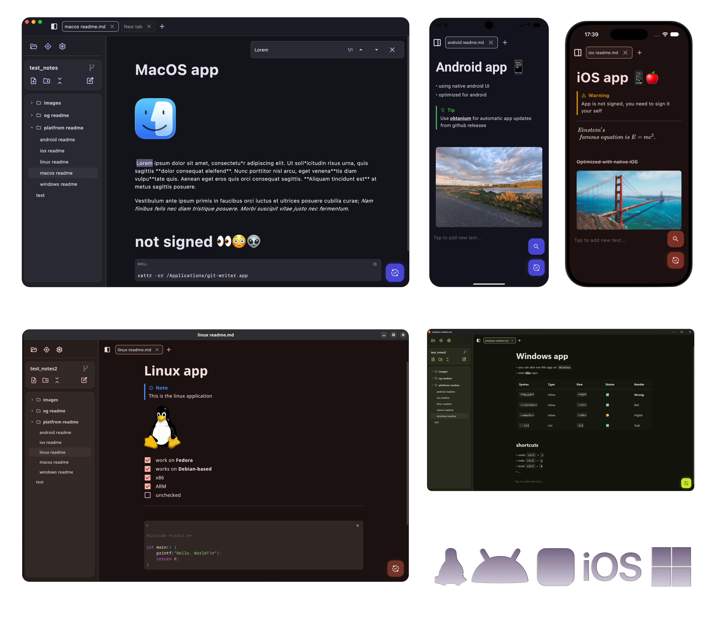

# Git Writer

A minimalistic, cross-platform note-taking app that uses Git repositories to keep your Markdown notes version-controlled
and synchronized across devices. Supports all major platforms (Linux, macOS, Windows, Android, iOS).


---

## Installation

Download binaries from the [**Releases**](https://github.com/jotalac/git-writer/releases) page.

> [!WARNING]
> - **macOS:** app is not signed, to make it work, you may need run this command: `xattr -d com.apple.quarantine /Applications/GitWriter.app`  
> - **iOS:** The `.ipa` is unsigned. Sideload it using tools like [AltStore](https://altstore.io/), [SideStore](https://sidestore.io/), or [Sideloadly](https://sideloadly.io/) with your free Apple ID.

---



---
Support this project with a coffee:

<a href='https://ko-fi.com/R6R71KF055' target='_blank'></a>

---

### Using:

- [Kotlin Multiplatform](https://kotlinlang.org/docs/multiplatform.html) & [Compose Multiplatform](https://github.com/jetbrains/compose-multiplatform)
- **Git Integration**: [JGit](https://www.eclipse.org/jgit/) (Desktop and Android), [libgit2](https://github.com/libgit2/libgit2)
- **Image & File Handling**: [Coil 3](https://github.com/coil-kt/coil) & [FileKit](https://github.com/vinceglb/FileKit)
- **Markdown parsing & rendering**:
  [multiplatform-markdown-renderer](https://github.com/mikepenz/multiplatform-markdown-renderer)
  & [jetbrains-markdown](https://github.com/JetBrains/markdown)

---

### Building app

#### Desktop Distributions

- **Current OS**:
  ```bash
  ./gradlew :desktopApp:packageDistributionForCurrentOS
  ```

- **Linux (`.deb` / `.rpm`)**:
  ```bash
  ./gradlew :desktopApp:packageDeb
  ./gradlew :desktopApp:packageRpm
  ```
- **macOS (`.dmg` / `.pkg`)**:
  ```bash
  ./gradlew :desktopApp:packageDmg
  ./gradlew :desktopApp:packagePkg
  ```
- **Windows (`.msi` / `.exe`)**:
  ```bash
  ./gradlew :desktopApp:packageMsi
  ./gradlew :desktopApp:packageExe
  ```

*Output location: `desktopApp/build/compose/binaries/main/`*

#### Android Release

- **Release APK**:
  ```bash
  ./gradlew :androidApp:assembleRelease
  ```
  *Output location: `androidApp/build/outputs/apk/release/`*

#### iOS Release

- Build in Xcode

---

## Contributing

Contributions are always welcome! If you find a bug or have an idea for an enhancement, feel free to open an **Issue**.
