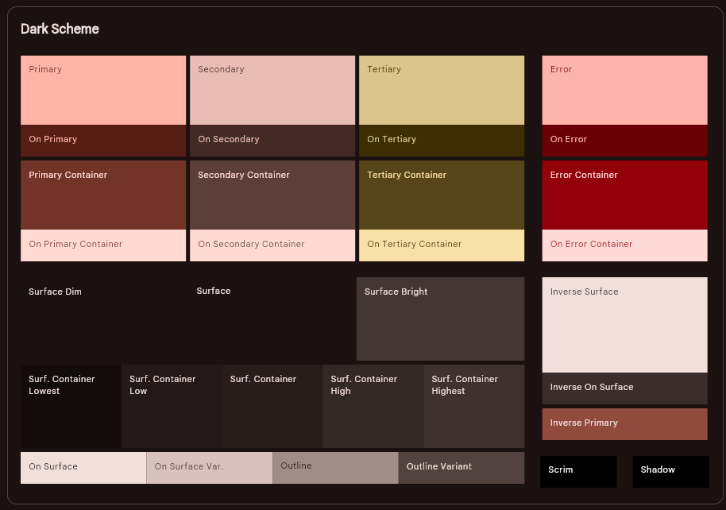
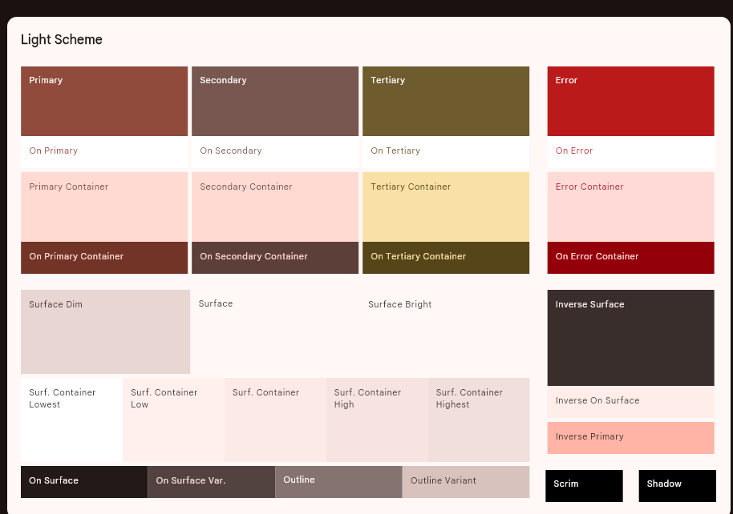

# Git-writer - git synced markdown editor

## TODO

- when renaming item - rename it
- git sync :o

### TODO - not important (extra features)

- customize the markdown elements from the markdown library
- when renaming image resource – refactor the notes to use the new image name?
- maybe add the action bar on desktop - like it is in the IDEA markdown editor
- default warning, tip, success github like quotes that should be supported by mikepenz markdown library - doesnt work

- 
- 