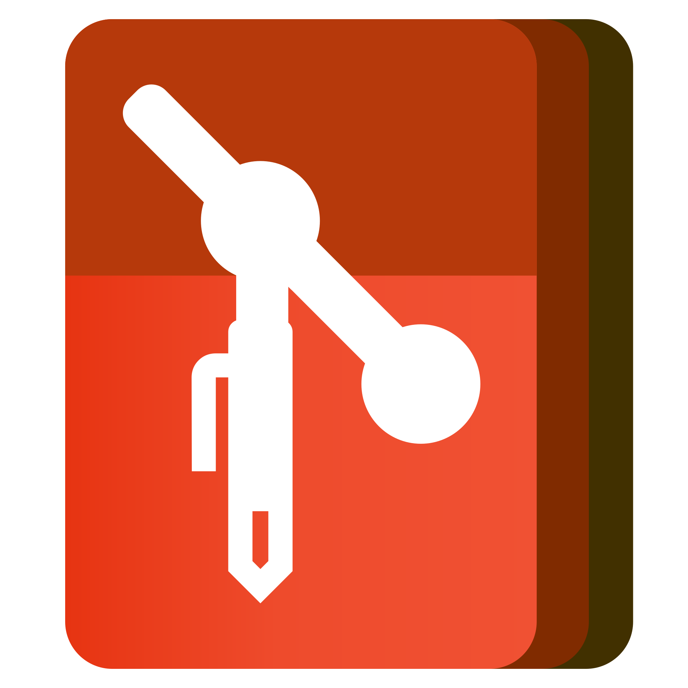
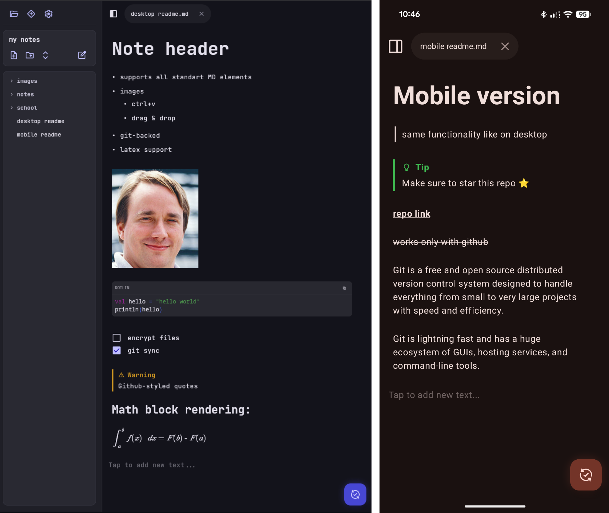

# Git-Writer

A minimalistic, cross-platform note-taking app that uses Git repositories to keep your Markdown notes version-controlled
and synchronized across devices. Supports all major platforms (Linux, macOS, Windows, Android, iOS).



> [!WARNING]
> This project is still in active development, and there is no stable release yet.  
> New features and bug fixes are being added regularly.

---

## Download

Pre-built binaries are available on the [**Releases**](https://github.com/jotalac/git-writer/releases) page.

> [!NOTE]
> macOS and iOS builds are not yet available as I don't have access to a macOS device

---



---

### Using:

- [Kotlin Multiplatform](https://kotlinlang.org/docs/multiplatform.html) & [Compose Multiplatform](https://github.com/jetbrains/compose-multiplatform)
- **Git Integration**: [JGit](https://www.eclipse.org/jgit/) (Desktop and Android)
- **Image & File Handling**: [Coil 3](https://github.com/coil-kt/coil) & [FileKit](https://github.com/vinceglb/FileKit)
- **Markdown parsing & rendering**:
  [multiplatform-markdown-renderer](https://github.com/mikepenz/multiplatform-markdown-renderer)
  & [jetbrains-markdown](https://github.com/JetBrains/markdown)

---

### Building for Release

#### Desktop Distributions

> [!NOTE]
> Desktop native packages are built using `jpackage` on the respective host OS (e.g., build Windows packages on Windows,
> Linux packages on Linux, macOS packages on macOS).

- **Current OS**:
  ```bash
  ./gradlew :desktopApp:packageDistributionForCurrentOS
  ```

- **Linux (`.deb` / `.rpm` / `.appImage`)**:
  ```bash
  ./gradlew :desktopApp:packageDeb
  ./gradlew :desktopApp:packageRpm
  ./gradlew :desktopApp:packageAppImage
  ```
- **macOS (`.dmg` / `.pkg`)**:
  ```bash
  ./gradlew :desktopApp:packageDmg
  ./gradlew :desktopApp:packagePkg
  ```
- **Windows (`.msi` / `.exe`)**:
  ```bash
  ./gradlew :desktopApp:packageMsi
  ./gradlew :desktopApp:packageExe
  ```

*Output location: `desktopApp/build/compose/binaries/main/`*

#### Android Release

- **Release APK**:
  ```bash
  ./gradlew :androidApp:assembleRelease
  ```
  *Output location: `androidApp/build/outputs/apk/release/`*

#### iOS Release

- Build in Xcode

---

## Contributing

Contributions are always welcome! If you find a bug or have an idea for an enhancement, feel free to open an **Issue**.