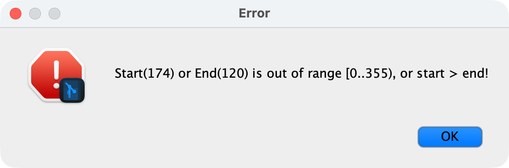

## TODO

> high priority

- add tests :((((
- there is this error message when trying to highlight text multiple times, idk just playing with the highligting 

> medium priority

- save the expanded folder to database (so that the file tree looks the same on app open)+ save all tabs that were opened
- add spell checks for current active block (at least on desktop and android)
- empty lines at the end are removed on file reload
- add encryption possibility, this looks nice but probably wont work with iOS devices (<https://github.com/cryptomator/cryptofs>)
- make file header like in obsidian - the file heading will show the file name changing the header will change the filename
- lists are splitted into multiple blocks, but when reloaded it is only one list block (no other components are in the middle of it)
- add something like .gitwriter file to each notebook folder, there will be the remote credentials etc., it wont be commited, but comes in handy when you want to open folder with remote already configured
- when opening notebooks, when two noteboks have same directory name but the path is different, it cannot be opened
- add bottom bar - info button and character/word count (add some help to topAppBar - usage, shortcuts in the app,
  markdown cheatsheet, etc.)
- add ctrl+r replace (replace all/current)
- enable proguad and manually configure it to lower the binary size (android and desktop)
- follow clean architecture and introduce UseCases instead of injecting repositories into *r*epositories
- run periodic git fetch to display if the notes are actually up to date (or just run it once on notebook open)
- made custom top app bar - it looks horrible on Windows at least
- in the settings as possibility to change the commit message
- add nucleus fs-watcher (or other fs watcher)

> other ideas - lower priority

- add possibility to export notes to pdf
- look at the CRDT Automerge possibility to automerge notes  
- share notes on mobile? like normal share button to quickshare, email ...
- in the file tree show which files are modified (based on the git status)
- when renaming image resource – refactor the notes to use the new image name?
- add some highlight cursor to the file tree so that i can be operated only with keyboard (f2 for renaming and ctrl+n
  for new file)
- better messages while syncing (eg. when nothing is commited or pulled - display up to date message)
- make username and password optional for cloning when cloning public repo – then the sync would be disabled?
- check for network connection, when there is no connection, disable the sync button